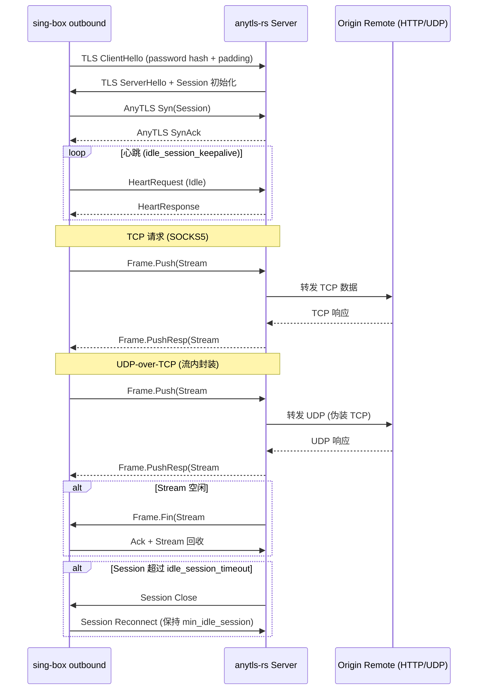

# sing-box outbound ⇄ anytls-rs 服务端：MVP 方案

## 1. 用户故事与场景

- 作为 DevOps，我希望在内网部署 `anytls-rs` 服务端，外网 sing-box outbound 通过 AnyTLS 协议复用/穿透，以隐藏 TLS 指纹并复用长连接。
- 作为 网络工程师，我需要在 UDP-over-TCP、心跳保持、空闲会话回收策略上与 sing-box 的配置保持一致，确保长连接低延迟且可观测。
- 作为 QA，我要用最短脚本在本地完成 sing-box outbound → anytls-rs 服务端的 TCP/UDP 双向验证，并产出基准指标。

### 时序图（TCP + UDP-over-TCP + 心跳）



## 2. 技术路径对比

| 路径 | 描述 | 改动范围 | 风险 | 回滚策略 | 价值 |
|------|------|----------|------|----------|------|
| **A. anytls-rs 作为服务端（首选）** | 直接复用现有 server 组件，sing-box outbound 发起连接 | 主要在 `server/handler.rs`, `session/session.rs`, 文档、样例、脚本 | - UDP-over-TCP 兼容性<br>- 心跳/idle 参数对齐<br>- tracing 覆盖不足 | 保持原 CLI；新增功能通过 feature flag 或默认关闭 | 最小化改动；与主线保持一致；可快速验证 sing-box outbound |
| B. anytls-rs 作为客户端，连接 sing-box inbound | 让 anytls-rs 模拟 outbound，验证互通 | 需要扩展 `client/` 支持 sing-box inbound 期望的握手/TLS | - 引入大量新逻辑<br>- CLI 参数分叉 | 保持现有客户端模式；新增 `--mode singbox` | 可做互通回归，但实现成本高；适合作为备选或后续回归 |

## 3. 小步提交计划

1. **提交 1：添加 e2e 示例与文档**
   - 文件：`docs/02-feature-mvp-plan.md`、`docs/adr/0001-singbox-anytls-e2e.md`、`examples/singbox/README.md`
   - 内容：配置字段对照表、模板、风险说明
   - 测试：无代码改动；文档 lint（`mdbook` / `markdownlint`）
   - 验收：QA 能根据文档完成本地最短启动

2. **提交 2：最小观测埋点**
   - 文件：`server/server.rs`（新增 `tracing::span`）、`session/session.rs`（记录 `session_id`, `stream_id`, bytes）
   - 函数：`Server::run`, `Session::handle_frame`, `SessionPool::cleanup`
   - 测试：`cargo test --tests`；新增 `tests/logging.rs` 检查关键字段
   - 验收：日志包含握手、心跳、流关闭、超时等字段

3. **提交 3：UDP-over-TCP 用例与基准**
   - 文件：`tests/udp_roundtrip.rs`（新增）、`benches/e2e_bench.rs`（扩展）
   - 涉及函数：`UdpProxy::handle_datagram`, `UdpClient::send`
   - 测试：`cargo test udp_roundtrip`；`cargo bench --bench e2e_bench`
   - 验收：UDP 回环成功；基准记录 p50/p95 latency

4. **提交 4：最小脚本与 FAQ**
   - 文件：`scripts/dev-up.sh`（若尚未落盘则补上）、`docs/FAQ.md`、`docs/TROUBLESHOOTING.md`
   - 内容：`make dev-up`/`Taskfile`/`docker-compose` 说明；常见错误与解决
   - 测试：`bash scripts/dev-up.sh` 在 macOS/Linux 可跑通
   - 验收：一键启动 sing-box outbound → anytls-rs → curl 验证

## 4. 最小 e2e 实验清单

### 4.1 sing-box outbound 配置模板

```json
{
  "outbounds": [
    {
      "type": "anytls",
      "tag": "anytls-demo",
      "server": "SERVER_HOST",
      "server_port": 8443,
      "password": "SINGBOX_PASSWORD",
      "idle_session_check_interval": "30s",
      "idle_session_timeout": "120s",
      "min_idle_session": 1,
      "tls": {
        "enabled": true,
        "server_name": "SERVER_DOMAIN",
        "insecure": true
      }
    }
  ]
}
```

### 4.2 anytls-rs 服务端启动示例

```bash
cargo run --release --bin anytls-server -- \
  -l 0.0.0.0:8443 \
  -p SINGBOX_PASSWORD

# 如需加载外部证书
cargo run --release --bin anytls-server -- \
  -l 0.0.0.0:8443 \
  -p SINGBOX_PASSWORD \
  --cert /path/to/server.crt \
  --key /path/to/server.key
```

- 快速联调：`./scripts/dev-up.sh`（默认复用 `examples/singbox/certs/anytls.local.{crt,key}`；可通过 `HTTP_ADDR=127.0.0.1:8080` 同时启动 HTTP 代理；支持 `IDLE_SESSION_CHECK_INTERVAL` / `IDLE_SESSION_TIMEOUT` / `MIN_IDLE_SESSION` 环境变量映射客户端会话池，对应 CLI `-I/-T/-M`、服务端 `-I/-T/-M`）
- 自动化校验：`./scripts/dev-verify.sh`（启动服务端/客户端并通过 SOCKS5 执行 curl 验证）

- 建议日志：`RUST_LOG=info,anytls=debug`
- 观测关键字段：`session_id`, `stream_id`, `bytes_in/out`, `idle_reason`

---

# ADR 0001：sing-box outbound ⇄ anytls-rs 服务端对接

- 状态：Proposed
- 作者：<你的姓名>
- 日期：2025-11-08
- 决策类型：架构/集成

## 背景

- 目标：提供 sing-box outbound → anytls-rs 服务端 的最小可行对接，覆盖 TCP、UDP-over-TCP、心跳和空闲会话回收。
- 约束：低延迟、稳定复用、可回滚、易观测，保留现有 CLI 行为。

## 决策

1. **首选方案**：保持 anytls-rs 作为服务端角色，兼容 sing-box outbound。  
   - 修改点集中在文档、示例、观测补丁，核心协议无需破坏性变更。  
   - 扩展 tracing 埋点，补齐 UDP/心跳日志。  
   - 提供 e2e 示例与基准脚本。
2. **备选方案**：anytls-rs 作为客户端接入 sing-box inbound（互通回归）。  
   - 暂不实施，仅记录需求；后续可在 client 模块引入 `--mode singbox`。

## 考量

- 兼容性：对齐 sing-box AnyTLS 字段（`password`, `idle_session_check_interval`, `min_idle_session`, `tls.*`），并支持外部证书 (`--cert/--key`)。
- 安全性：保留 SHA256 + padding；评估 `md5` 可替换可能。
- 可观测性：增加握手、心跳、流关闭、超时的 span 与字段。
- 回滚：所有新增功能通过文档/脚本与 feature flag 控制；不破坏核心行为。

## 后续计划（摘要）

- 文档化配置与示例。
- 扩展 tracing 与指标输出。
- 编写 UDP-over-TCP 回环测试与基准。
- 补充 FAQ 与故障排查指南。

## 风险

- UDP-over-TCP 与 sing-box v1.12 行为差异。
- 会话池参数默认值与 sing-box 不一致。
- 观测不足导致排查困难。

## 参考

- sing-box AnyTLS outbound 配置：<https://sing-box.sagernet.org/configuration/outbound/anytls/>
- anytls-go 实现：<https://github.com/anytls/anytls-go>
- anytls-rs `server/`, `session/`, `client/` 模块源码

